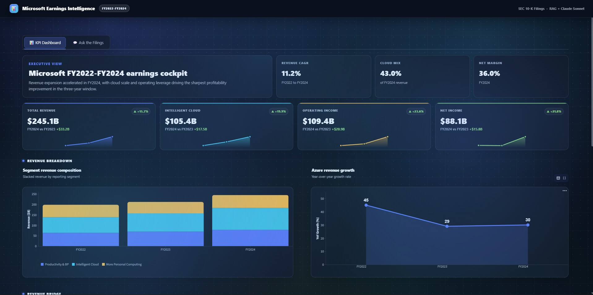
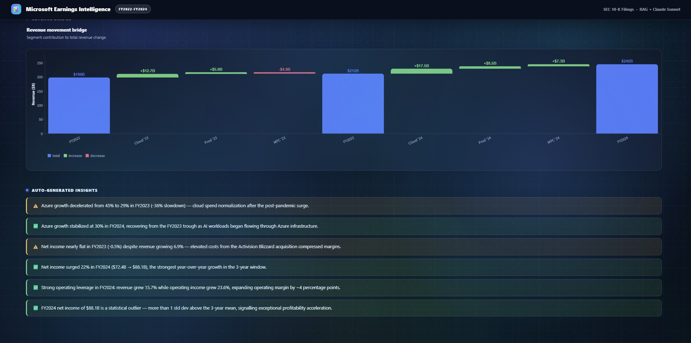
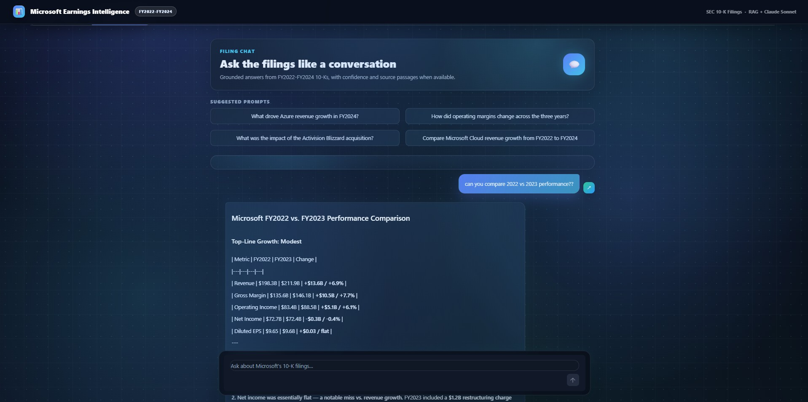
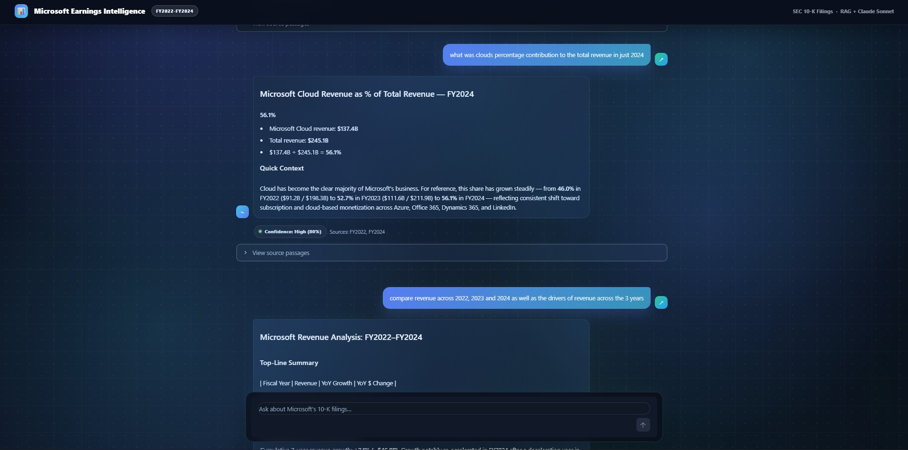

# Microsoft Earnings Intelligence Analyst

A Streamlit application that turns Microsoft's SEC 10-K annual filings (FY2022-FY2024) into an interactive intelligence platform, combining a KPI dashboard with an AI-powered chatbot that answers questions directly from the source documents.

Built with **Claude Sonnet**, **ChromaDB**, and **HuggingFace embeddings**.

---

## Screenshots

### KPI Dashboard



### RAG Chatbot



---

## Features

- **KPI Dashboard**: Interactive year-over-year comparisons for revenue, operating income, cloud growth, and more, with SVG sparklines and Altair charts
- **RAG Chatbot**: Ask natural-language questions about the filings; Claude Sonnet answers using only the retrieved context from the actual 10-K documents
- **Source transparency**: Every chatbot answer surfaces the source chunks it used, so you can verify the grounding
- **Dark-mode UI**: Glassmorphism design with a fixed header, tab navigation, and a floating chat input

---

## Tech Stack

| Layer | Technology |
|---|---|
| Frontend | Streamlit |
| LLM | Anthropic Claude Sonnet (`claude-sonnet-4-6`) |
| Vector Store | ChromaDB |
| Embeddings | HuggingFace `sentence-transformers` |
| Indexing | LlamaIndex |
| Data Viz | Altair, Apache ECharts |
| Document Parsing | python-docx |

---

## Project Structure

```
earnings-intelligence-analyst/
├── app.py                        # Main Streamlit entry point
│
├── components/
│   ├── kpi_dashboard.py          # KPI cards, sparklines, and charts
│   └── rag_chatbot.py            # RAG pipeline and chat UI
│
├── scripts/
│   ├── parse_docs.py             # Extracts text from .docx 10-K filings
│   ├── extract_kpis.py           # Parses KPIs into kpis.json
│   └── chunk_and_embed.py        # Chunks text and builds the ChromaDB index
│
├── data/
│   ├── raw/                      # Original .docx 10-K filings (2022–2024)
│   ├── processed/                # Plain-text versions of the filings
│   └── kpis.json                 # Structured KPI data used by the dashboard
│
├── vectorstore/
│   └── chroma_db/                # Pre-built ChromaDB vector index
│
├── utils/
│   └── formatting.py             # Number formatting and anomaly detection helpers
│
├── static/
│   └── echarts.min.js            # Bundled ECharts library
│
├── .streamlit/
│   └── config.toml               # Streamlit theme and server config
│
├── .env.example                  # Environment variable template
└── requirements.txt
```

---

## Getting Started

### Prerequisites

- Python 3.10+
- An [Anthropic API key](https://console.anthropic.com/)

### 1. Clone the repository

```bash
git clone https://github.com/Isha2605/earnings-intelligence-rag.git
cd earnings-intelligence-rag
```

### 2. Create a virtual environment

```bash
python -m venv venv
source venv/bin/activate        # macOS/Linux
venv\Scripts\activate           # Windows
```

### 3. Install dependencies

```bash
pip install -r requirements.txt
```

### 4. Set up environment variables

```bash
cp .env.example .env
```

Open `.env` and add your Anthropic API key:

```
ANTHROPIC_API_KEY=your_anthropic_api_key_here
```

### 5. Run the app

```bash
streamlit run app.py
```

The app opens at `http://localhost:8501`.

> **Note:** The ChromaDB vector store is pre-built and included in the repo. You do not need to run the embedding scripts to use the chatbot.

---

## Data Pipeline (Optional Rebuild)

If you want to rebuild the vector index from scratch:

```bash
# Step 1: Parse the .docx filings into plain text
python scripts/parse_docs.py

# Step 2: Extract structured KPIs into data/kpis.json
python scripts/extract_kpis.py

# Step 3: Chunk the text and rebuild the ChromaDB index
python scripts/chunk_and_embed.py
```

---

## How It Works

```
.docx filings
     │
     ▼
parse_docs.py  ──►  data/processed/*.txt
     │
     ▼
extract_kpis.py ──► data/kpis.json  ──►  KPI Dashboard
     │
     ▼
chunk_and_embed.py ──► ChromaDB vectorstore
                              │
                              ▼
               User question ──► Embedding lookup
                              │
                              ▼
                     Top-k chunks ──► Claude Sonnet ──► Answer
```

1. Raw Word documents are parsed to plain text.
2. KPIs are extracted into a JSON file powering the dashboard charts.
3. Text is chunked and embedded into ChromaDB using a HuggingFace sentence-transformer model.
4. At query time, the user's question is embedded and matched against the index; the top-k chunks are passed to Claude Sonnet as context to generate a grounded answer.

---

## Environment Variables

| Variable | Description |
|---|---|
| `ANTHROPIC_API_KEY` | Your Anthropic API key, required for the chatbot |

---

## License

MIT
